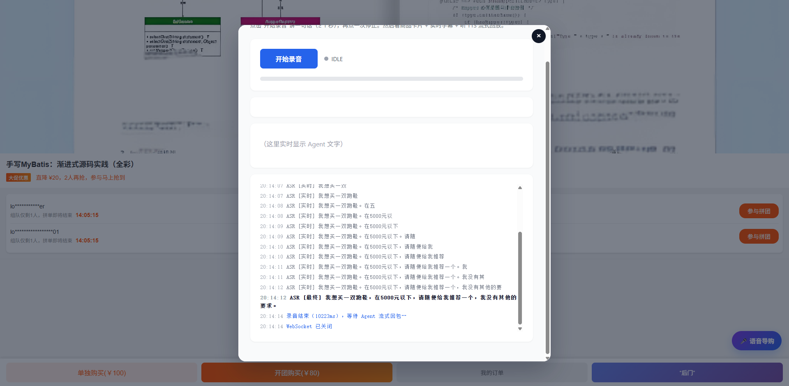
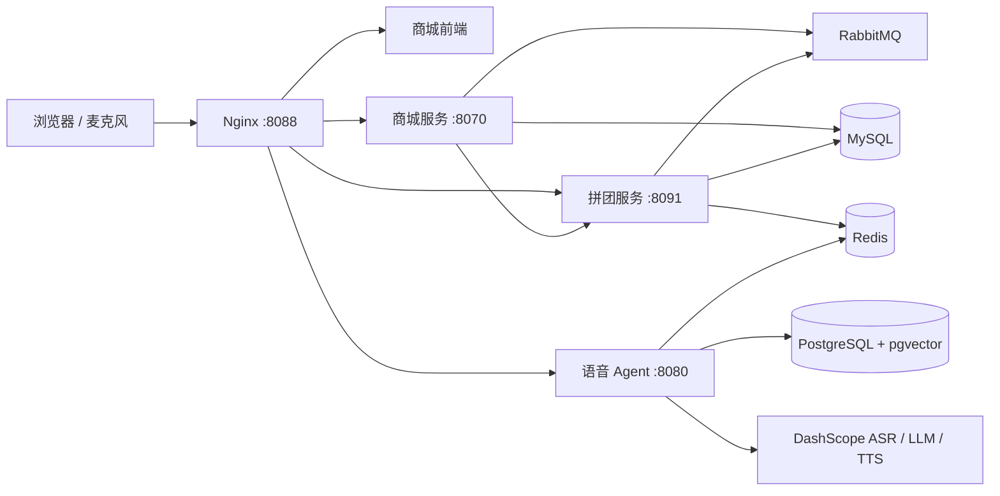

# 爱拼团智能商城

爱拼团是一个将商品商城、限量拼团交易与实时语音 AI 导购打通的端到端电商演示系统。用户可以搜索和筛选商品，通过语音表达预算与品类需求，并从 Agent 推荐直接进入商品详情或打开拼团。

> 本仓库以经授权代码为基础，完成深度二次开发、系统融合与统一部署。新增工作集中在商品目录、响应式商城、商城与 Agent 会话适配、语音交易动作及单入口容器化交付。



## 功能

- 响应式商城首页、商品搜索、分类和价格筛选
- 多商品目录、拼团价、原价和参团人数展示
- 商品详情、拼团活动、库存校验、订单与支付状态流转
- Streaming ASR、意图与槽位识别、RAG 推荐和 Streaming TTS
- 语音搜索商品、筛选价格、查看详情和打开拼团
- Nginx 同域代理，商城、拼团与 Agent 统一从一个网址访问
- Docker Compose 一键启动 MySQL、Redis、RabbitMQ、PostgreSQL 与全部应用

## 系统架构



更详细的模块说明见 [架构文档](docs/architecture.md)。

## 目录

```text
web/                         商城前端
services/mall-service/       商品、订单与支付服务
services/group-buy-service/  拼团活动与库存服务
services/voice-agent/        实时语音导购 Agent
database/                    MySQL 初始化数据
deploy/nginx/                统一入口与 WebSocket 代理
docs/                        架构、接口与演示资料
```

## 本地启动

要求：Docker Desktop、Docker Compose，以及可用的阿里云百炼 DashScope API Key。

```bash
cp .env.example .env
# 编辑 .env，填写 DASHSCOPE_API_KEY
docker compose up -d --build
```

Windows PowerShell 可使用：

```powershell
Copy-Item .env.example .env
# 编辑 .env，填写 DASHSCOPE_API_KEY
docker compose up -d --build
```

启动后访问：<http://127.0.0.1:8088/>

```bash
docker compose ps
docker compose logs -f voice-agent
docker compose down
```

首次初始化数据库和构建 Java 服务需要数分钟。浏览器使用语音导购时需要允许麦克风权限。

## 演示指令

- “给我推荐 500 元以内的跑鞋”
- “找一些 500 元以内的数码产品”
- “打开第一款商品”
- “打开第一款拼团”

## 配置安全

- 真实密钥只放在本地 `.env`，该文件已被 Git 忽略。
- 仓库只提供 `.env.example`，不包含可用密钥。
- 公共环境应替换默认数据库和消息队列密码，并通过 HTTPS 暴露入口。
