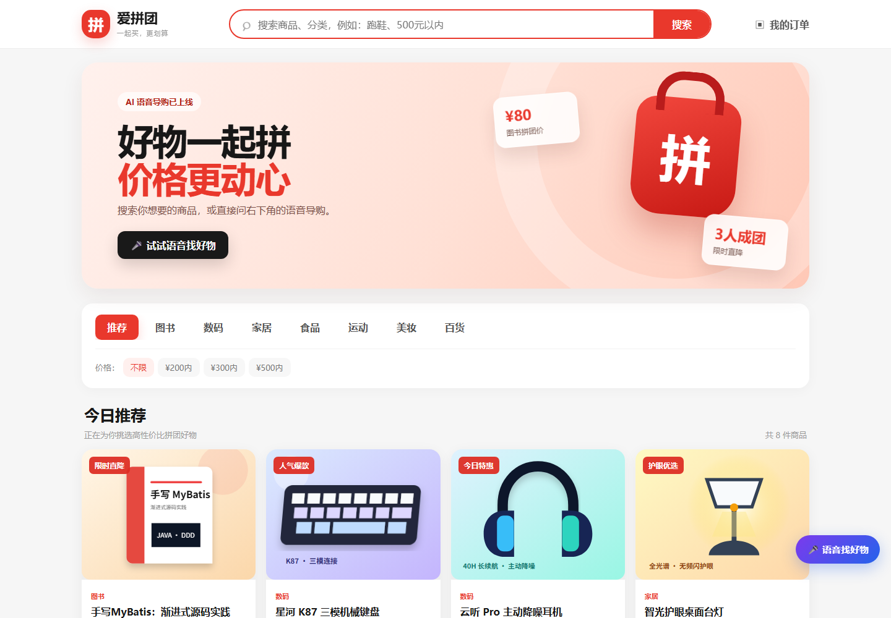
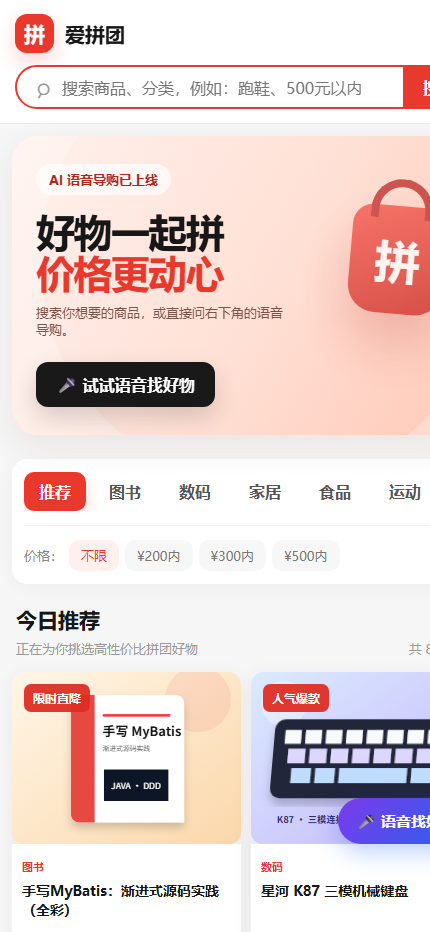
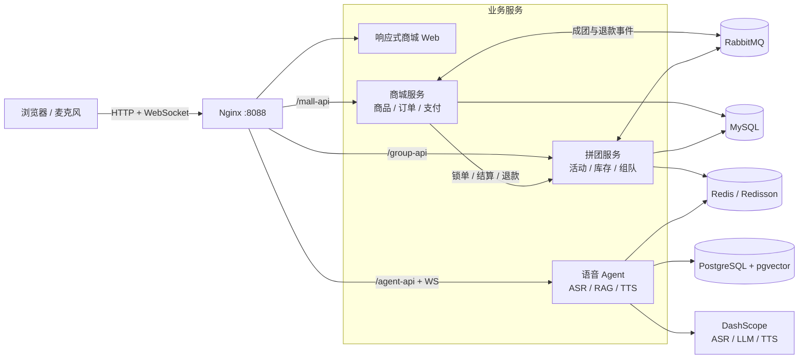
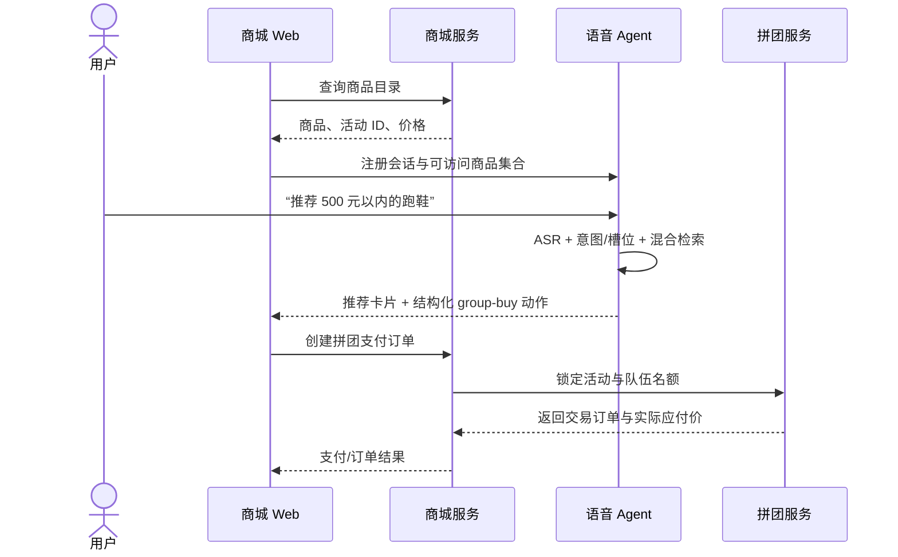

# 爱拼团 · AI Native Group-Buy Mall

<p align="center">
  <strong>把实时语音理解、商品检索与拼团交易闭环放进同一个可部署系统</strong>
</p>

<p align="center">
  
  
  
  
  
</p>

爱拼团不是单独的聊天页面，也不是只展示优惠信息的商城 Demo。它将 **商品目录、拼团交易、订单支付与实时语音 Agent** 组合为一条可执行链路：用户说出品类和预算，Agent 在商城授权的商品集合中检索并解释推荐结果，随后通过结构化动作打开真实商品详情或拼团入口，最终价格、库存与订单仍由交易域裁决。

> 项目重点在于解决 AI 应用落地中的三个边界问题：**模型不持有交易真相、Agent 动作必须可约束、异构服务需要统一交付**。

## 在线效果



<table>
  <tr>
    <td width="68%"></td>
    <td width="32%"></td>
  </tr>
  <tr>
    <td align="center">Streaming ASR → Agent 推理 → 商品动作</td>
    <td align="center">430px 视口下的双列商品与语音入口</td>
  </tr>
</table>

## 项目亮点

| 方向 | 工程实现 | 解决的问题 |
| --- | --- | --- |
| AI 与交易隔离 | 会话注册时下发商城商品白名单；Agent 仅返回 `view` / `group-buy` 等结构化动作 | 避免模型虚构商品、价格或直接写交易数据 |
| 实时语音链路 | 浏览器音频经 WebSocket 上传，串联流式 ASR、Agent 增量响应与流式 TTS | 降低长请求的等待感，支持边识别、边生成、边播报 |
| 混合商品检索 | pgvector HNSW 语义召回 + SQL 品类/预算硬过滤 + 用户画像重排 | 兼顾语义相关性和价格、品类等确定性约束 |
| 拼团一致性 | 订单唯一键保证外部调用幂等；条件更新限制组队人数；RabbitMQ 解耦成团通知 | 防止重复订单、超员锁单，并隔离跨域状态传播 |
| 领域建模 | 商城与拼团分别采用 API / Trigger / Domain / Infrastructure / Types 分层 | 让活动规则、交易规则和基础设施实现保持清晰边界 |
| 单入口交付 | Nginx 同域代理 HTTP 与 WebSocket；Compose 编排 8 个应用与基础设施容器 | 浏览器只访问一个地址，降低本地联调和服务器部署成本 |
| 可观测与兼容 | 拼团服务暴露 Actuator / Prometheus；SQL 兼容 MySQL 8 `ONLY_FULL_GROUP_BY` | 为运行诊断提供入口，并避免依赖宽松数据库模式 |

## 系统架构



### 语音推荐到开团



这里最重要的设计是：**Agent 负责理解与编排，交易服务负责事实与决策**。即使模型返回了错误价格，商城也不会采用该值；下单请求只携带商品、活动和队伍标识，服务端重新计算最终金额。

## 核心领域设计

### 1. 拼团交易

- 活动配置负责有效期、目标人数、折扣与渠道规则。
- 锁单阶段以外部交易号作为幂等边界，并通过数据库条件更新控制队伍容量。
- 结算、超时退款和成团通知分离；RabbitMQ 将商城订单域与拼团域的状态传播解耦。
- 通知任务保留状态与重试次数，避免一次网络失败直接丢失业务事件。

### 2. AI 导购

- WebSocket 承载浏览器音频及流式响应，HTTP 接口负责会话注册和商品上下文同步。
- 意图识别区分搜索、查看详情、购买与闲聊；预算、品类等槽位进入确定性过滤链路。
- PostgreSQL/pgvector 保存商品与 FAQ 向量，Redis 保存短期会话状态和缓存。
- 推荐结果携带商城 `goodsId` / `activityId`，前端只执行白名单动作，不能执行任意脚本或任意接口。

### 3. 商城融合层

- 商品目录接口为首页、详情页和 Agent 提供统一数据源。
- 桌面端与移动端共享同一套响应式页面，支持关键词、品类和拼团价筛选。
- Nginx 将三套后端收敛为同源路径，避免浏览器跨域配置，并为语音 WebSocket 保留 Upgrade 连接。

## 技术栈

| 子系统 | 技术 |
| --- | --- |
| 商城服务 | Java 8、Spring Boot 2.7、MyBatis、MySQL、RabbitMQ |
| 拼团服务 | Java 8、Spring Boot 2.7、DDD、MyBatis、Redis / Redisson、RabbitMQ、Actuator |
| 语音 Agent | Java 21、Spring Boot 4、AgentScope、DashScope、WebSocket、PostgreSQL / pgvector、Redis |
| Web | HTML5、CSS3、Vanilla JavaScript、响应式布局、Web Audio API |
| 交付 | Docker Compose、Nginx、健康检查、持久化 Volume、环境变量注入 |

## 仓库结构

```text
.
├─ web/                              # 商城首页、详情、订单、语音导购组件
├─ services/
│  ├─ aipintuan-mall/                # 商品目录、订单、支付与拼团结果消费
│  ├─ aipintuan-group-buy/           # 活动、折扣、组队、锁单、结算与退款
│  └─ aipintuan-voice-agent/         # 实时语音、检索推荐、记忆与商城动作
├─ database/                         # MySQL 初始化结构与演示数据
├─ deploy/nginx/                     # 单域名 HTTP / WebSocket 路由
├─ docs/                             # 架构说明与真实运行截图
└─ docker-compose.yml                # 应用及基础设施统一编排
```

## 快速启动

### 环境要求

- Docker Desktop 与 Docker Compose
- 可用的阿里云百炼 DashScope API Key（语音与模型能力需要）
- 建议为 Docker 分配至少 6 GB 内存

### 1. 创建本地配置

```bash
cp .env.example .env
```

Windows PowerShell：

```powershell
Copy-Item .env.example .env
```

编辑 `.env`，填入 `DASHSCOPE_API_KEY`。真实密钥不会进入 Git。

### 2. 启动完整环境

```bash
docker compose up -d --build
docker compose ps
```

首次下载镜像和构建 Java 服务需要数分钟。全部容器就绪后访问：

```text
http://127.0.0.1:8088/
```

浏览器使用语音导购时需要允许麦克风权限。

### 3. 验证关键接口

```bash
curl http://127.0.0.1:8088/mall-api/api/v1/catalog/products
curl http://127.0.0.1:8088/agent-api/api/v1/ping
```

```bash
docker compose logs -f aipintuan-mall aipintuan-group-buy aipintuan-voice-agent
docker compose down
```

## 演示路径

建议按下面顺序展示，能够在 3 分钟内覆盖完整业务价值：

1. 在商城首页搜索“跑鞋”，切换 `¥500 内`筛选并进入详情页。
2. 打开右下角语音导购，说：“给我推荐 500 元以内的跑鞋。”
3. 观察实时 ASR、Agent 推荐卡片和 TTS 播报。
4. 继续说：“打开第一款拼团。”
5. 页面携带商品标识进入详情，并由商城与拼团服务完成真实锁单链路。

可直接尝试：

- “找一些 300 元以内的数码产品”
- “给我推荐适合通勤的双肩包”
- “打开第一款商品”
- “打开第一款拼团”

## 工程验证

```bash
# 商城服务
cd services/aipintuan-mall && mvn clean package

# 拼团服务
cd services/aipintuan-group-buy && mvn clean package

# 编排文件静态校验
docker compose config
```

本项目不在 README 中展示未经压测验证的 QPS、延迟或并发数字；性能结论应由固定硬件、数据规模和压测脚本共同给出。

## 进一步演进

- 为锁单、支付回调和退款链路增加 Testcontainers 集成测试。
- 接入 Prometheus + Grafana 仪表盘，并为 ASR 首字延迟、Agent 首 Token 延迟和 TTS 首包延迟建立 SLI。
- 将通知任务升级为 Outbox / CDC，强化跨服务事件的可追溯性。
- 引入灰度 Prompt 与离线评测集，量化推荐命中率、工具调用准确率和幻觉率。

## 开发说明

本仓库基于获得授权的代码基础进行深度二次开发与系统融合。当前仓库新增和重构的重点包括多商品目录、响应式商城首页、商城—Agent 会话适配、语音交易动作、统一品牌与配置、单入口反向代理及容器化交付。设计细节参见 [架构说明](docs/architecture.md)。

## Author

**zhongwn** · <2518166961@qq.com>
